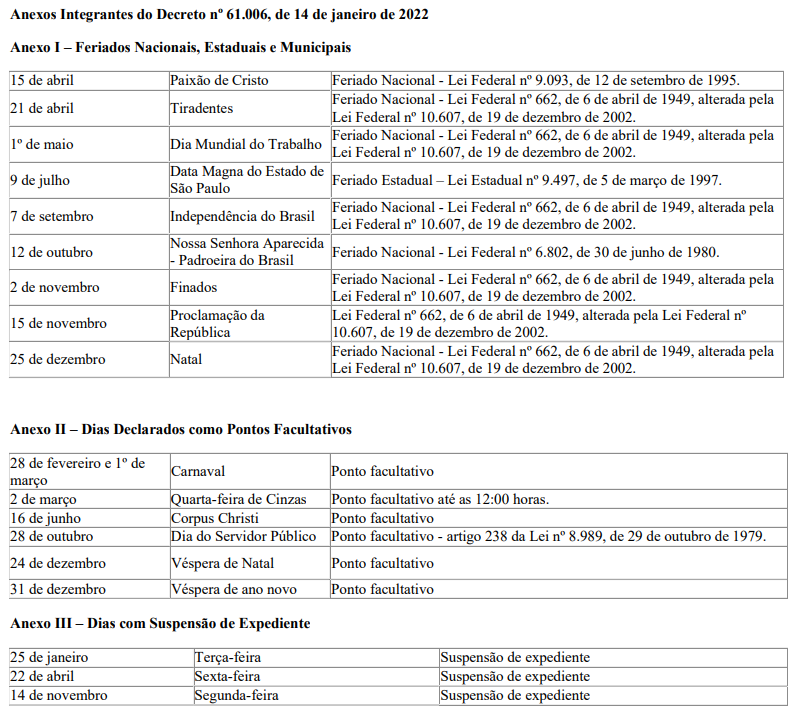

# Estágio Gustavo

## Contratação

- [Plano de Estágio](anexos/plano_estagio_gustavo.xlsx)
- [Formulário de Contratação](anexos/formulario_contratacao_gustavo.docx)
- [Atestado de Matrícula (FATEC-ZL)](anexos/atestado_matricula.pdf)
- [Contrato](anexos/contrato.pdf)
- [Termo de Compromisso](anexos/termo_compromisso.pdf)
- [RG](anexos/RG.jpeg) / [CPF](anexos/CPF.jpeg)
- [Requerimento de Estágio - 1º Semestre de 2022](anexos/requerimento_estagio_2022_01.pdf)
- [Relatório de Estágio - 1º Semetre de 2022](anexos/relatorio_estagio_2022_01.pdf)

## Documentação Geral

- [Horários e Histórico](docs/HORARIOS.md)
- [Materiais de estudo](docs/ESTUDO.md)

## Plano de Estágio

Unidade: SMIT/CGTIC/DEPRO.

Atividades previstas:
- Levantamento e análise de requisitos;
- Configuração de ambientes de desenvolvimento;
- Codificação/desenvolvimento frontend, backend e banco de dados;
- Testes de sistema e análise de dados.

## Atividades permanentes

- Alura
- Materiais institucionais:
    - SMIT
    - PETIC 2021-2024
    - Wiki MS Teams
- Atualizar [lista de horários](docs/HORARIOS.md) semanalmente

## Links úteis

- [CITI](http://citi.pmsp/)
- [Diário Oficial](http://www.docidadesp.imprensaoficial.com.br/)
- [Portal de Governança](https://tecnologia.prefeitura.sp.gov.br/)

## Anexos

- [Material institucional da SMIT](anexos/SMIT_INSTITUCIONAL.pdf)
- [PETIC 2021-2024](anexos/PETIC_2021_2024.pdf)
- [Reserva de almoço](anexos/smit-almoco.pdf)
- [Feriados 2022](https://legislacao.prefeitura.sp.gov.br/leis/decreto-61006-de-14-de-janeiro-de-2022)

